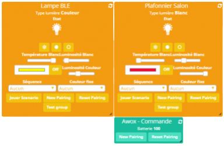

AWOX / EGLO Bluetooth Mesh
============

Information
------------

### Produits compatibles ###

  * [Gamme AWOX Mesh](http://www.awox.com/awox_product)
  
    * SmartLIGHT MESH [c9](http://www.awox.com/awox_product/smartlight-c9-mesh-2/)
    * SmartLIGHT MESH Globe [c13](http://www.awox.com/awox_product/smartlight-c13-mesh-globe/)

  * [Gamme EGLO Bluetooth](http://www.eglo.com/france/Produits2/Concepts/EGLO-connect-bluetooth-R) (voir le catalogue)
  
    * Dalles et plafonniers LED de différentes formes & tailles (une vingtaine)
    * Ampoules type AWOX (3 formats)
	
*Tous ces modèles supportent les lumières blanches (chaud-froid) et 16 millions de couleurs)
	

### Intégration Jeedom ###

Ce qui fonctionne: 

  * Commandes des couleurs blanches et des couleurs
  * Pairage et dépairage
  * Fonctionne avec la télécommande
  * Possibilité d'ajouter plusieurs équipements à un ou plusieurs groupes (jusqu'à 10)
  * Les commandes peuvent être lancées sur un groupe ou individuellement
  * Retour de tous les états (couleur, luminosité, état...)
  * Activation des séquences préconfigurées

Ce qui ne fonctionne pas / améliorations possibles:

  * L'intégration Jeedom rend l'application Android/iOS incompatible
  * La commande peut prendre un peut de temps à se lancer
  * Pas de retour d'état si l'ampoule n'est plus alimentée et restera sur son dernier état connu.  
  
  
### Changements ###

  * 1er février 2018 : Première version

### Captures d'écran ###

  * Dashboard
  

  * Plugin
  

Configuration
------------

 1. Pour un tout nouvel achat, mettre à jour le firmware en associant l'équipement à l'appli téléphone. 
 Un fois à jour, faire un reset de l'équipement.

 2. Pour utilisation avec télécommande, associer les équipements avec le(s) télécommande(s).   
 S'assurer avant qu'aucun équipement est configuré dans l'application téléphone.

 3. Activer le mode inclusion du plugin BLEA.  
 Les équipements sont normalement reconnus directement.  
 Pour la télécommande, il est nécessaire d'appuyer les boutons 'ON' et 'Bleu' pendant quelques secondes pour activer le Bluetooth temporarairement.

 4. Vérifier que les antennes emeteurs et recepteurs sont bien selectionnés  
 Ajouter les équipements sur le dashboard
 A ce stade, les équipements doivent pouvoir être commandés.

 5. Pairer les équipements pour les fonctionnalités avancées (ex: groupes)
 Cliquer sur le bouton 'New Pairing'. Attendre environ 10-20 secondes, la lmuière va clignoter et doit finir de couleur verte.
 Si ce n'est pas le cas, recommencer l'opération.
 Pour la télécommande, il est nécessaire d'appuyer les boutons 'ON' et 'Bleu' pendant quelques secondes pour activer le Bluetooth temporarairement (pas de lumière verte de fin dans ce cas).
 Tester le pairage des équipements et la gestion par groupe avec le bouton 'Test Group'.
 
 6. Finaliser la configuration des composants du dashboard
 Cacher les actions et informations inutiles (ex: boutons de pairages et test) 

Configuration avancée
------------

  * Ajouter/supprimer un équipement à un groupe.  
  Aller sur la page des commandes et trouver 'Add/Remove Group'.  
  Changer la valeur de `value:X` avec X le groupe à ajouter/enlever (ne pas oublier de sauvegarder).
  Appliquer la commande avec le bouton Test
  Note: Par défault le pairage initial associe chaque équipement au groupe '1'.  

  
  
  * Utiliser les groupes pour les commandes.   
  Ajouter au champ LogicalId d'une commande la valeur `gp:X` avec X le groupe concerné (ne pas oublier de sauvegarder).  
  Il est aussi possible de passer le groupe directement dans la valeur *value* avec le format `NuméroGroupe$valeur`.
  

  
  
  * Utilisation avancée dans un scénario.  
  Il est possible d'appliquer une commande avancée simplement via un scénario en utilisant la commande `Custom Code` de l'équipement.  
    * *Titre* = nom de la commande (voir liste des commandes disponibles plus bas)
	* *Message* = `NuméroGroupe$valeur` (séparateur est '$') pour utilisation sur groupe ou `valeur` sur l'équipement uniquement
  

Commandes disponibles
------------

A utiliser dans le champ LogicalId d'une commande.  

Format : `name:awoxmesh,cmd:COMMANDE,value:VALEUR` (ex: `name:awoxmesh,cmd:power,value:1`)  
  
*Note: `name:awoxmesh` est obligatoire pour chaque commande.*

`COMMANDE` de base:
    * `power` : on/off  
	> `VALEUR` : 1 ou 0 (pour on/off)
    * `setWhiteTemperature` : température de blanc  
	> `VALEUR` : entre 0 (min) et 100 (max)
    * `setWhiteBrightness` : luminosité blanc  
	> `VALEUR` : entre 0 (min) et 100 (max) 
    * `setWhite` : temp et luminosité de blanc  
	> `VALEUR` : *température*-*luminosité* ex: 50-100 (blanc neutre luminosité max)
    * `setColor` : couleur  
	> `VALEUR` : *#XXYYZZ*  
	ex: #00FF00 (couleur au format html [voir ici](https://html-color-codes.info/))
    * `setColorBrightness` : luminosité couleur  
	> `VALEUR` : entre 0 (min) et 100 (max)
    * `setColorLight` : couleur et luminosité  
	> `VALEUR` : *couleur*-*luminosité*  
	ex: #00FF00-100 (vert luminosité max)
    * `setSequence` : séquence prédéfinie  
	> `VALEUR` : entre 0 et 6
    * `setSequenceColorDuration` : durée couleur pour séquence  
	> `VALEUR` : *X* (en miliseconds)
    * `setSequenceFadeDuration` : temps de transistion pour séquence  
	> `VALEUR` : *X* (en miliseconds)
    * `playScenario` : scénario simple  
	> `VALEUR` : color/white/power*&*duration|color/white/power*&*duration|...|X  (X: nombre d'itération)  
    ex: `#DF0101-100&1|100-100&0.5|50-50&1|0&1|1&0.5|4` : Jouer 4 fois la séquence *couleur(1s), blanc(0.5s), autre blanc(1s), off(1s) et on(0.5s)*
	
`COMMANDE` autres:
    * `resetMesh` : dépairage  
	> `VALEUR` : 0 (valeur non utilisée)
    * `setNewPairing` : pairage  
	> `VALEUR` : 0 (valeur non utilisée)
    * `addMeshGroup` : ajouter groupe  
	> `VALEUR` : *NumeroGroupe*
    * `delMeshGroup` : enlever groupe  
	> `VALEUR` : *NumeroGroupe*

	
Autres
------------

Liste divers
    * Reset (dépairage manuel d'un équipement (sans l'appli) : Voir [video](https://youtu.be/WSuPGxZp1_c)  
	
	
    * Autres [videos](http://www.eglo.com/france/Produits2/Concepts/EGLO-connect-bluetooth-R) en cas dde problème

	